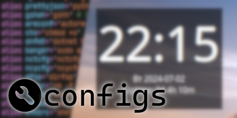

<p align="center">
    
</p>

[wrench icon](https://www.flaticon.com/free-icons/wrench)

Hi, this is *configs*, a repository hosting my configurations for programs (such as `.bashrc`) and
some scripts as well.

## Installation

Copy-paste these commands to install all configs:

```bash
git clone https://github.com/IAmMoltony/configs ~/configs # clone the repository
cd ~/configs # go into the repo dir
./install-cascadia-code.sh # install cascadia code (OPTIONAL, don't run if you
                           # don't need the font)
./install.sh # install configurations
source ~/.bashrc # reload bashrc 
```

## Scripts

### HCS

HCS (Hourly Config Sync, also referred to as Cron Sync) is a convenient system
for automatically backing up configs.

See `CronSync.md`.

### Wallpaper changer

The wallpaper changer script changes the wallpaper using `feh`, designed for use
in an environment with no DE.

Wallpaper changer requires a file called `/etc/moltony-wallpaper-changer.conf`
to be created. The repository provides an example of the file. Copy it into
`/etc` and change to your liking.

#### ok but why do i have to copy it to `/etc`???

So at some point I set up the wallpaper changer as a systemd timer, which do not
set the `HOME` variable, so I had to use a fixed path that does not depend on
the user for configuration. Too late (lazy) to change it now.

## Warning

All configs and scripts for installing/updating/syncing assume that this repo is
in your home directory, so make sure you clone it there or symlink it.
